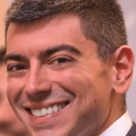

I was born in Foggia, Italy. I have always been passionate about computers and software in general, and so I decided to pursue a degree in Computer Engineering. I discussed my thesis and got my M.Sc. degree in May 2015.

I am now a Researcher at Software Improvement Group (aka SIG) in Amsterdam, working with Delft University of Technology (aka TU Delft) in the context of the European SENECA project focusing on software product quality. I will be spending also some time at Universidad Rey Juan Carlos in Madrid. Read more [here](/research).